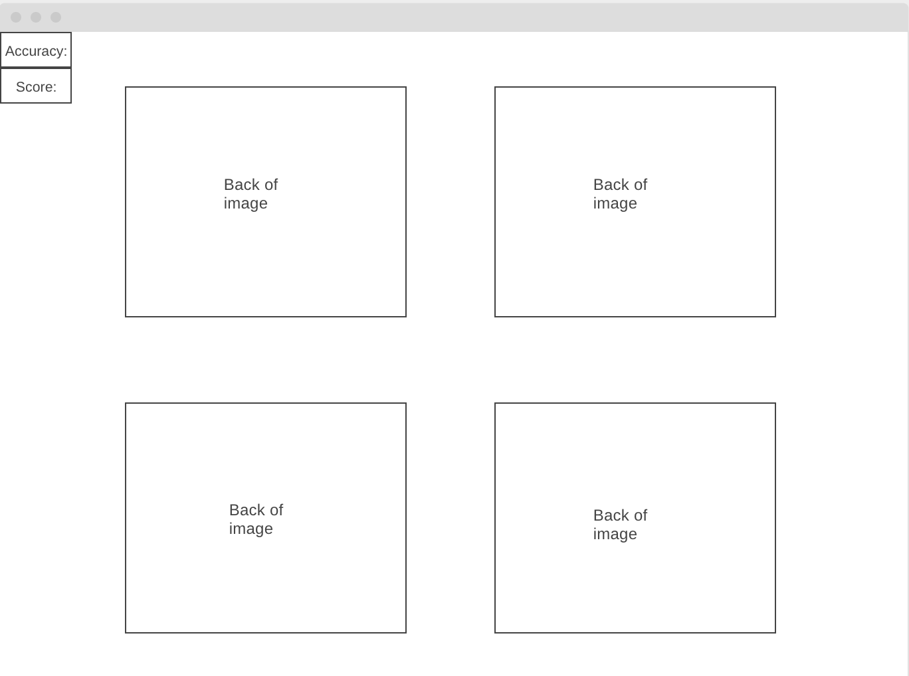

# Memory Game: Utah Edition
For my first project I chose to create a memory game! 

### Motivation
The motivation for creating this game was to complete a game start to finish with a strict deadline. I knew how to play memory so that was a good enough start! 

### User Stories & Wireframes
To start building my memory game it was helpful to wireframe the basic functionality behind the game. Most of already know how to play, but building it is a different story! I used wireframe.cc to draw the game how I wanted to build it. It's also helpful to create user stories to imagine how the user will play the game. 

The planning materials used to build this app

## User Stories
* The user should be able to click on a card to reveal an image
* Only allow the user to select two cards at a time
* Indicate if those cards are a match by adding a point to the score board 
* Indicate the cards are not a match by changing their image back to a blank card
* The user should be able to win the game once all matches have been made

## image files of wireframes

---
### Technologies Used
* HTML, CSS & Vanilla JS
### Building parts of my game! 

---
### Credits
This game was a great introduction to game logic and using javaScript to manipulate the DOM. Some websites I used for help along the way:
*[Medium](https://code.likeagirl.io/js-set-a-background-using-code-1cc26cf96ce4)
*[Codepen](https://code.likeagirl.io/js-set-a-background-using-code-1cc26cf96ce4)
---

### Future development
I created my first game!! This is a very exciting moment...however it still needs work! 
Future improvements:
* Be able to restart game to play again
* Allow users to click faster, there's currently a bug that needs fixing :) 
* Set a timer
* Include an accuracy rating to encourage the user to play more and see how they improve!

